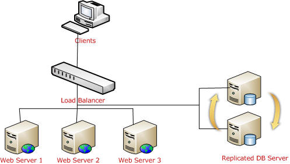
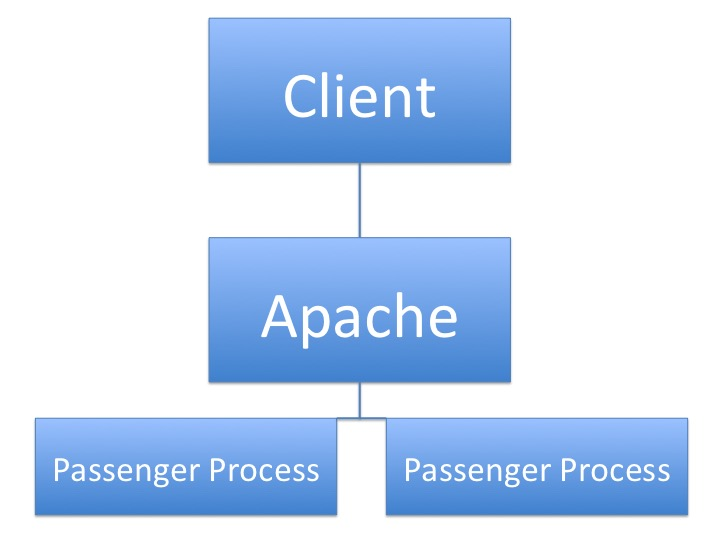

# Production Infrastructure

## Overview of Production Architecture
- Most production infrastructure is built to withstand a lot of traffic.
- There are a lot of aspects to take into consideration when planning a production-ready architecture.
- A very common approach is multiple instances over a load balancer with a master-master replicated database:



## Instance Architecture
- Similarly, instances themselves with have a multi-tiered architecture.
- Apache will be responsible for serving the static files (html, css, js, images), and Passenger will handle all of the Rails related logic.
- Passenger is a Ruby server, so it is the only piece that can understand Ruby code.



## Running Rails with Apache and Passenger
- Running Rails in production with Passenger and Apache is industry-standard for the web.
- A great tutorial by Digital Ocean can be found [here](https://www.digitalocean.com/community/tutorials/how-to-deploy-a-rails-app-with-passenger-and-apache-on-ubuntu-14-04).
- Here are the steps from their tutorial:

##### Step 1: Install Ruby

##### Step 2: Install Rails

##### Step 3: Install Apache

```
sudo apt-get install apache2
```

##### Step 4: Set up Passenger installation

```
sudo apt-key adv --keyserver keyserver.ubuntu.com --recv-keys 561F9B9CAC40B2F7
```

Create the passenger list file:

```
sudo nano /etc/apt/sources.list.d/passenger.list
```

Add this line to it:

```
deb https://oss-binaries.phusionpassenger.com/apt/passenger trusty main
```

Change permissions for the list file:

```
sudo chown root: /etc/apt/sources.list.d/passenger.list
sudo chmod 600 /etc/apt/sources.list.d/passenger.list
```

##### Step 5: Update apt-get

```
sudo apt-get update
```

##### Step 6: Install Passenger module

```
sudo apt-get install libapache2-mod-passenger
```

##### Step 7: Ensure Passenger-Apache module is active

```
sudo a2enmod passenger
```

##### Step 8: Restart Apache

```
sudo service apache2 restart
```

##### Step 9: Deploy Rails application with Git and check to make sure all checks are done for it to run in production mode.

##### Step 10: Create virtual host file for Apache and open it

```
sudo cp /etc/apache2/sites-available/000-default.conf /etc/apache2/sites-available/testapp.conf
```

Open config:

```
sudo nano /etc/apache2/sites-available/testapp.conf
```

##### Step 11: Change testapp.conf to match this file:

```
<VirtualHost *:80>
	ServerName example.com
	ServerAlias www.example.com
	ServerAdmin webmaster@localhost
	DocumentRoot /home/rails/testapp/public
	RailsEnv development
	ErrorLog ${APACHE_LOG_DIR}/error.log
	CustomLog ${APACHE_LOG_DIR}/access.log combined
	<Directory "/home/rails/testapp/public">
		Options FollowSymLinks
		Require all granted
	</Directory>
</VirtualHost>
```

##### Step 12: Disable the default site and enable ours

```
sudo a2dissite 000-default
sudo a2ensite testapp
sudo service apache2 restart
```

Your app should now be available at http://your-ip

##### Step 13 (later on): Update regularly to make sure software is up to date

```
sudo apt-get update && sudo apt-get upgrade
```

Restart after upgrade to make sure changes are implemented:

```
sudo service apache2 restart
```

## Apache-Passenger Lab
- Spend a few minutes and try to work through the above tutorial and get your member list application running in production through Apache-Passenger.
- As a first step I would recommend running the standard Rails server in production first to make sure all is well before trying to tackle Apache:

```
rails s -e production -b 0.0.0.0
```

## Production Database
- Working with databases is its own beast.
- Databases are complex because they are being hit all by themselves by an enomous amount of traffic.
- To combat this, techniques such as indexing, master-master replication, and multi-az deployment are implemented.
- Databases like any other server are vulnerable to failure, so they are generally monitored closely by a professional database administrator (DBA).
- Who has time and energy to do all this?! That's why Amazon invented the Relational Database Service (RDS).
- RDS is a database-as-a-service provider which handles these tough database issues for you at a price.
- We will be implementing a RDS database with our member list app together. To do this we will have to edit our database.yml file:

```yml
production:
  adapter: mysql2
  encoding: utf8
  database: database name here
  username: database username here
  password: database password here
  host: database host here
  port: 3306
```